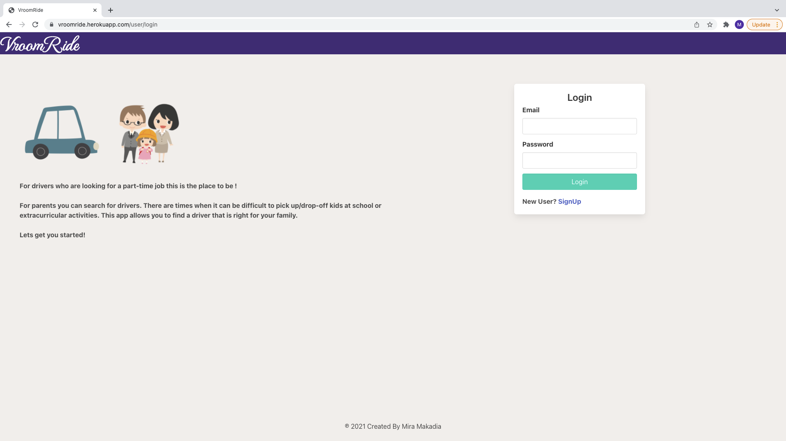
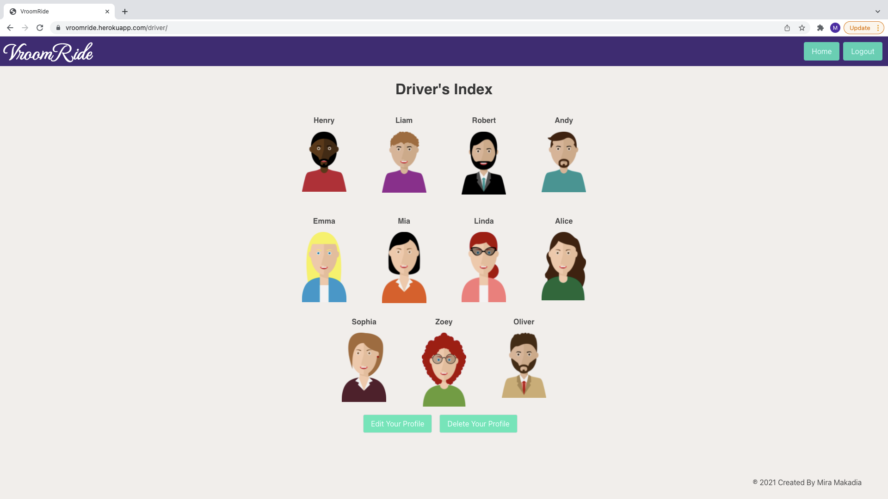
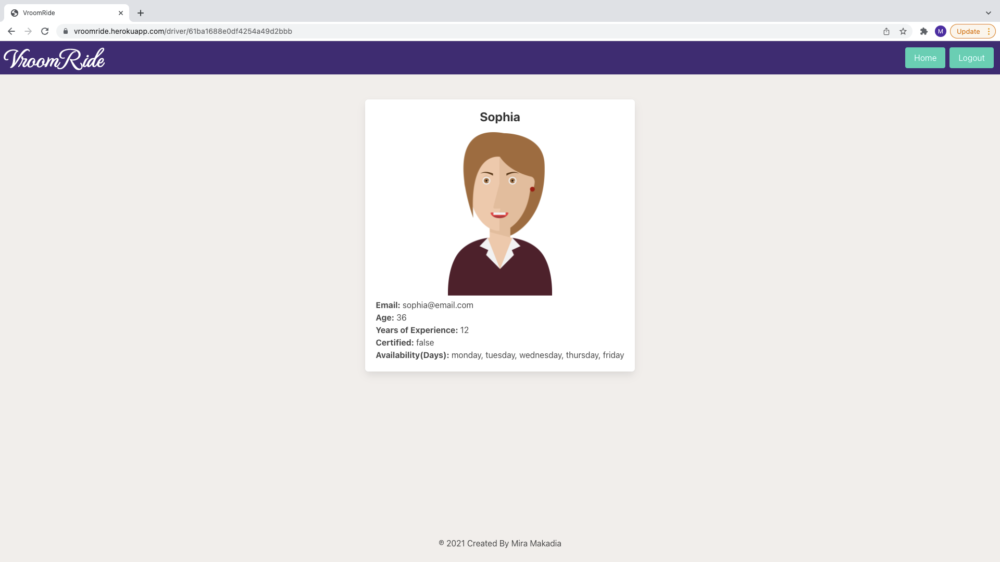
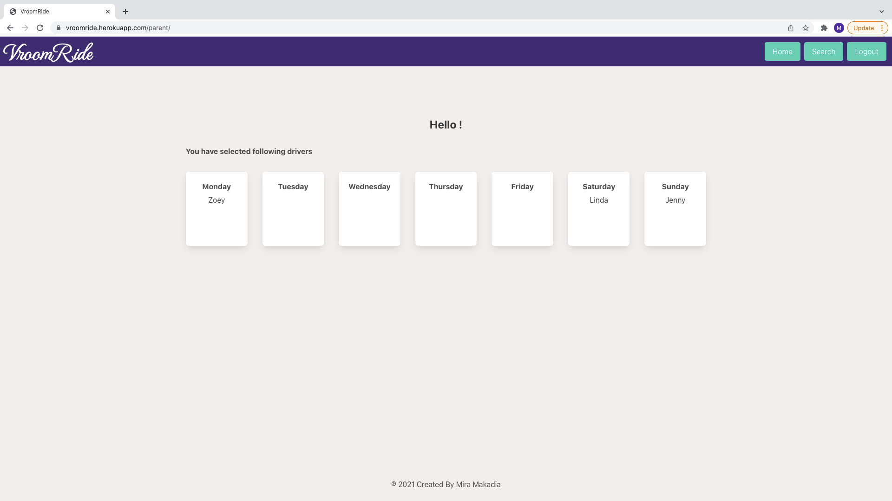
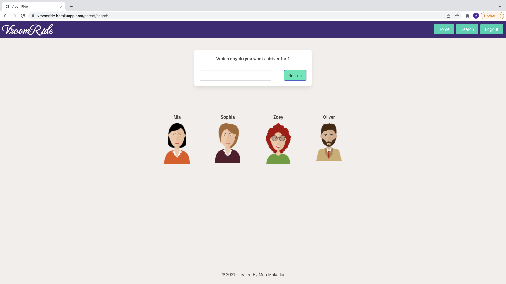

# VroomRide

This CRUD web application is for drivers who would want a part-time job and for parents who can search for drivers to pick up/drop-off kids.

There are times when it can be difficult for parents to pick up/drop-off kids at school or extracirricular activities. This app is useful for them as they can search for drivers for the coming week based on the day they want a driver and select them.

## Technologies Used

- HTML5
- CSS3
- JavaScript
- Moongoose
- Node.js
- Express
- MongoDB
- Bulma CSS framework
- Google Fonts

## Screenshots
### Login page

### driver home page

### driver show page

### parent home page

### search page

## Getting started

[Click Here](https://vroomride.herokuapp.com/) to see the deployed app!

## Future Enhancements

- Parent can write a review for a driver so that other parents can choose a driver based on feedback.
- Add more filters to the search engine.
- Add delete button on parents home page so they can remove selected drivers.